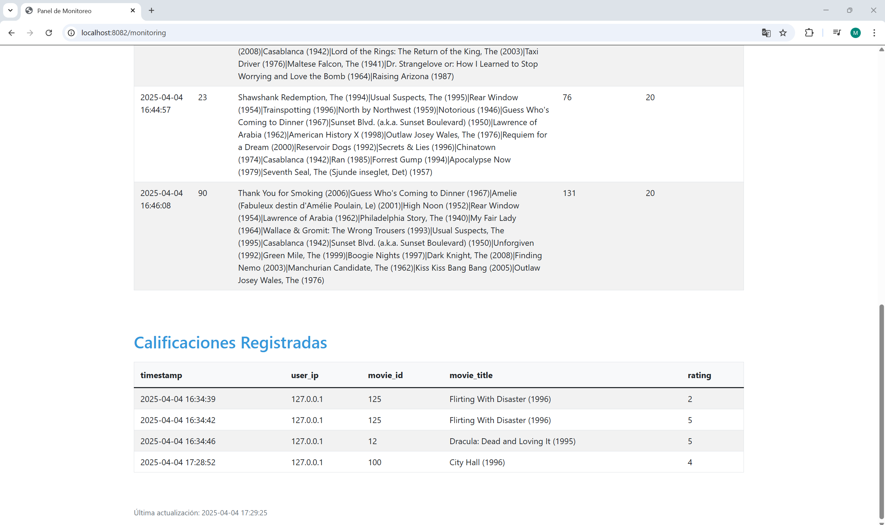

# Final - Movie Recommendations

## Milestone 2: Model and Infrastructure Quality

**Learning goals:**

* Test all components of the learning infrastructure
* Build an infrastructure to assess model and data quality
* Build an infrastructure to evaluate a model in production
* Use continuous integration to test infrastructure and models

**Screenshots**

